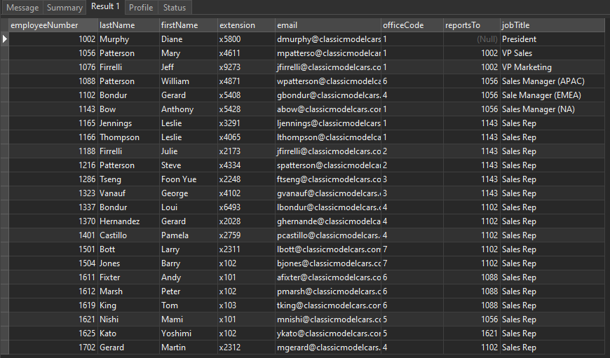
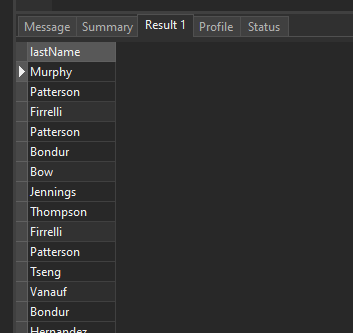
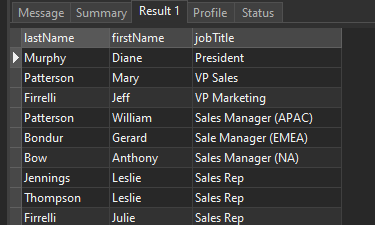

# MySQL SELECT

## MySQL SELECT 문 소개

SELECT 문은 하나 이상의 테이블에서 데이터를 조회할 수 있게 해줍니다. MySQL에서 SELECT 문을 작성하려면 다음 구문을 사용합니다:

```sql
SELECT select_list
FROM table_name;
```

이 구문에서:

- 첫째, SELECT 키워드 다음에 데이터를 선택하려는 하나 이상의 컬럼을 지정합니다. select_list에 여러 컬럼이 있는 경우 쉼표(,)로 구분해야 합니다.
- 둘째, FROM 키워드 다음에 데이터를 선택할 테이블 이름을 지정합니다.

세미콜론(;)은 선택사항입니다. 이것은 문장의 끝을 나타냅니다. 두 개 이상의 문장이 있는 경우 세미콜론(;)을 사용하여 구분해야 MySQL이 각 문장을 개별적으로 실행합니다.

SELECT와 FROM은 키워드입니다. 관례상 SQL 키워드는 대문자로 작성합니다. 하지만 필수는 아닙니다. SQL은 대소문자를 구분하지 않기 때문에 소문자, 대문자 등으로 SQL 문을 작성할 수 있습니다. 예를 들어:

```sql
select select_list
from table_name;
```

SELECT 문을 실행할 때 MySQL은 SELECT 절보다 FROM 절을 먼저 평가합니다:


## MySQL SELECT 문 예제

다음 예제들에서는 샘플 데이터베이스의 employees 테이블을 사용하겠습니다.


employees 테이블은 8개의 컬럼을 가지고 있습니다: employeeNumber, lastName, firstName, extension, email, officeCode, reportsTo, jobTitle. 테이블은 또한 다음 그림과 같이 많은 행을 포함하고 있습니다:



## A) 단일 컬럼에서 데이터를 조회하는 MySQL SELECT 문 예제

다음 예제는 SELECT 문을 사용하여 모든 직원의 성을 선택합니다:

```sql
SELECT lastName
FROM employees;
```

출력:


SELECT 문의 결과는 쿼리에서 나온 행들의 집합이므로 결과 집합(result set)이라고 합니다.

## B) 여러 컬럼에서 데이터를 조회하는 MySQL SELECT 문 예제

다음 예제는 SELECT 문을 사용하여 직원들의 이름, 성, 직책을 가져옵니다:

```sql
SELECT
    lastName,
    firstName,
    jobTitle
FROM
    employees;
```

출력:

employees 테이블에 많은 컬럼이 있더라도 SELECT 문은 SELECT 절에 지정된 lastName, firstName, jobTitle 세 개의 컬럼 데이터만 반환합니다:

## C) 모든 컬럼에서 데이터를 조회하는 MySQL SELECT 문 예제

employees 테이블의 모든 컬럼에서 데이터를 선택하려면 다음과 같이 SELECT 절에 모든 컬럼 이름을 지정할 수 있습니다:

```sql
SELECT employeeNumber,
       lastName,
       firstName,
       extension,
       email,
       officeCode,
       reportsTo,
       jobTitle
FROM   employees;
```

또는 모든 컬럼을 나타내는 단축 표현인 별표(\*)를 사용할 수 있습니다. 예를 들어:

```sql
SELECT *
FROM employees;
```

이 쿼리는 employees 테이블의 모든 컬럼에서 데이터를 반환합니다.

SELECT \*는 테이블의 모든 컬럼에서 데이터를 선택하므로 종종 "select star" 또는 "select all"이라고 합니다. 실무에서는 SELECT \*를 임시 쿼리에만 사용해야 합니다.

PHP, Java, Python, Node.js와 같은 코드에 SELECT 문을 포함시키는 경우, 데이터를 선택할 컬럼을 명시적으로 지정해야 합니다.

## 요약

- 테이블에서 데이터를 선택하려면 SELECT 문을 사용합니다.
- 테이블의 모든 컬럼에서 데이터를 선택하려면 SELECT \*를 사용합니다.
