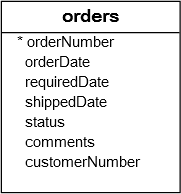

# MySQL ORDER BY

SELECT 문을 사용하여 테이블에서 데이터를 조회할 때, 결과 집합의 행 순서는 지정되지 않습니다. 결과 집합의 행을 정렬하려면 SELECT 문에 ORDER BY 절을 추가합니다.

다음은 ORDER BY 절의 구문을 보여줍니다:

```sql
SELECT
   select_list
FROM
   table_name
ORDER BY
   column1 [ASC|DESC],
   column2 [ASC|DESC],
   ...;
```

이 구문에서는 ORDER BY 절 다음에 정렬하려는 하나 이상의 컬럼을 지정합니다.

ASC는 오름차순을, DESC는 내림차순을 의미합니다. ASC를 사용하여 결과 집합을 오름차순으로 정렬하고, DESC를 사용하여 결과 집합을 내림차순으로 정렬합니다.

다음 ORDER BY 절은 column1의 값을 기준으로 결과 집합을 오름차순으로 정렬합니다:

```sql
ORDER BY column1 ASC;
```

다음 ORDER BY 절은 column1의 값을 기준으로 결과 집합을 내림차순으로 정렬합니다:

```sql
ORDER BY column1 DESC;
```

기본적으로 ORDER BY 절은 옵션을 명시적으로 지정하지 않으면 ASC를 사용합니다. 따라서 다음 ORDER BY 절들은 동일합니다:

```sql
ORDER BY column1 ASC;
```

그리고

```sql
ORDER BY column1;
```

여러 컬럼으로 결과 집합을 정렬하려면 ORDER BY 절에 쉼표로 구분된 컬럼 목록을 지정합니다:

```sql
ORDER BY
   column1,
   column2;
```

이 경우 ORDER BY 절은 먼저 column1을 기준으로 결과 집합을 오름차순으로 정렬한 다음, 정렬된 결과 집합을 column2를 기준으로 오름차순으로 정렬합니다.

한 컬럼은 오름차순으로, 다른 컬럼은 내림차순으로 결과 집합을 정렬하는 것도 가능합니다:

```sql
ORDER BY
    column1 ASC,
    column2 DESC;
```

이 경우 ORDER BY 절은:

- 먼저, column1의 값을 기준으로 결과 집합을 오름차순으로 정렬합니다.
- 그런 다음, 정렬된 결과 집합을 column2의 값을 기준으로 내림차순으로 정렬합니다. 이 단계에서 column1의 값 순서는 변경되지 않고 column2의 값 순서만 변경됩니다.

ORDER BY 절이 포함된 SELECT 문을 실행할 때 MySQL은 항상 FROM과 SELECT 절 다음에 ORDER BY 절을 평가합니다:

## MySQL ORDER BY 예제

데모를 위해 샘플 데이터베이스의 customers 테이블을 사용하겠습니다.


### A) 한 컬럼으로 결과 집합을 정렬하는 MySQL ORDER BY 절 예제

다음 쿼리는 ORDER BY 절을 사용하여 고객을 성을 기준으로 오름차순으로 정렬합니다.

```sql
SELECT
	contactLastname,
	contactFirstname
FROM
	customers
ORDER BY
	contactLastname;
```

고객을 성을 기준으로 내림차순으로 정렬하려면 다음 쿼리와 같이 ORDER BY 절의 contactLastname 컬럼 다음에 DESC를 사용합니다:

```sql
SELECT
	contactLastname,
	contactFirstname
FROM
	customers
ORDER BY
	contactLastname DESC;
```

### B) 여러 컬럼으로 결과 집합을 정렬하는 MySQL ORDER BY 절 예제

고객을 성을 기준으로 내림차순으로 정렬한 다음 이름을 기준으로 오름차순으로 정렬하려면, 다음과 같이 해당 컬럼에 DESC와 ASC를 모두 지정합니다:

```sql
SELECT
    contactLastname,
    contactFirstname
FROM
    customers
ORDER BY
	contactLastname DESC ,
	contactFirstname ASC;
```

이 예제에서 ORDER BY 절은 먼저 성을 기준으로 결과 집합을 내림차순으로 정렬한 다음, 정렬된 결과 집합을 이름을 기준으로 오름차순으로 정렬하여 최종 결과 집합을 만듭니다.

### C) 표현식으로 결과 집합을 정렬하는 MySQL ORDER BY 절 예제

다음 쿼리는 orderdetails 테이블에서 주문 라인 항목을 선택합니다. 각 라인 항목의 소계를 계산하고 소계를 기준으로 결과 집합을 정렬합니다.

```sql
SELECT
    orderNumber,
    orderlinenumber,
    quantityOrdered * priceEach
FROM
    orderdetails
ORDER BY
   quantityOrdered * priceEach DESC;
```

쿼리를 더 읽기 쉽게 만들려면 SELECT 절의 표현식에 컬럼 별칭을 할당하고 다음 쿼리와 같이 ORDER BY 절에서 해당 컬럼 별칭을 사용할 수 있습니다:

```sql
SELECT
    orderNumber,
    orderLineNumber,
    quantityOrdered * priceEach AS subtotal
FROM
    orderdetails
ORDER BY subtotal DESC;
```

이 예제에서는 quantityOrdered \* priceEach 표현식의 컬럼 별칭으로 subtotal을 사용하고 subtotal 별칭을 기준으로 결과 집합을 정렬합니다.

MySQL은 ORDER BY 절보다 SELECT 절을 먼저 평가하므로 ORDER BY 절에서 SELECT 절에 지정된 컬럼 별칭을 사용할 수 있습니다.

## 사용자 지정 목록을 사용하여 데이터를 정렬하는 MySQL ORDER BY 절 사용

FIELD() 함수는 다음 구문을 가집니다:

```sql
FIELD(str, str1, str2, ...)
```

FIELD() 함수는 str1, str2, ... 목록에서 str의 위치를 반환합니다. str이 목록에 없으면 FIELD() 함수는 0을 반환합니다. 예를 들어, 다음 쿼리는 1을 반환합니다. 문자열 'A'의 위치가 'A', 'B', 'C' 목록의 첫 번째 위치이기 때문입니다:

```sql
SELECT FIELD('A', 'A', 'B','C');
```

출력:

+--------------------------+
| FIELD('A', 'A', 'B','C') |
+--------------------------+
| 1 |
+--------------------------+
1 row in set (0.00 sec)

Code language: plaintext (plaintext)

다음 예제는 2를 반환합니다:

```sql
SELECT FIELD('B', 'A','B','C');
```

출력:

+-------------------------+
| FIELD('B', 'A','B','C') |
+-------------------------+
| 2 |
+-------------------------+
1 row in set (0.00 sec)

Code language: plaintext (plaintext)

더 실용적인 예를 살펴보겠습니다.

샘플 데이터베이스의 다음 orders 테이블을 참조하세요.



다음 순서로 상태별로 판매 주문을 정렬하려고 한다고 가정합니다:

- In Process
- On Hold
- Canceled
- Resolved
- Disputed
- Shipped

이를 위해 FIELD() 함수를 사용하여 각 주문 상태를 숫자로 매핑하고 FIELD() 함수의 결과로 결과를 정렬할 수 있습니다:

```sql
SELECT
    orderNumber, status
FROM
    orders
ORDER BY FIELD(status,
        'In Process',
        'On Hold',
        'Cancelled',
        'Resolved',
        'Disputed',
        'Shipped');
```

## MySQL ORDER BY와 NULL

MySQL에서 NULL은 NULL이 아닌 값보다 앞에 옵니다. 따라서 ORDER BY 절을 ASC 옵션과 함께 사용하면 NULL이 결과 집합의 맨 앞에 나타납니다.

예를 들어, 다음 쿼리는 ORDER BY 절을 사용하여 직원을 reportsTo 컬럼의 값으로 정렬합니다:

```sql
SELECT
    firstName, lastName, reportsTo
FROM
    employees
ORDER BY reportsTo;
```

그러나 ORDER BY를 DESC 옵션과 함께 사용하면 NULL이 결과 집합의 맨 뒤에 나타납니다. 예를 들어:

```sql
SELECT
    firstName, lastName, reportsTo
FROM
    employees
ORDER BY reportsTo DESC;
```

## 요약

- 하나 이상의 컬럼으로 결과 집합을 정렬하려면 ORDER BY 절을 사용합니다.
- 결과 집합을 오름차순으로 정렬하려면 ASC 옵션을, 내림차순으로 정렬하려면 DESC 옵션을 사용합니다.
- ORDER BY 절은 FROM과 SELECT 절 다음에 평가됩니다.
- MySQL에서 NULL은 NULL이 아닌 값보다 낮습니다.
