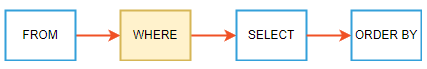
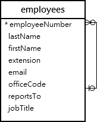

# MySQL WHERE

## MySQL WHERE 절 소개

SELECT 문을 사용하여 테이블에서 데이터를 조회할 때, 결과 집합의 행 순서는 지정되지 않습니다. 결과 집합의 행을 정렬하려면 SELECT 문에 ORDER BY 절을 추가합니다.

다음은 ORDER BY 절의 구문을 보여줍니다:

```sql
SELECT
   select_list
FROM
   table_name
ORDER BY
   column1 [ASC|DESC],
   column2 [ASC|DESC],
   ...;
```

search_condition은 논리 연산자 AND, OR, NOT을 사용하는 하나 이상의 표현식의 조합입니다.

MySQL에서 조건식(predicate)은 TRUE, FALSE 또는 UNKNOWN으로 평가되는 부울 표현식입니다.

SELECT 문은 search_condition을 만족하는 모든 행을 결과 집합에 포함시킵니다.

SELECT 문 외에도 UPDATE 또는 DELETE 문에서 WHERE 절을 사용하여 업데이트하거나 삭제할 행을 지정할 수 있습니다.

WHERE 절이 포함된 SELECT 문을 실행할 때 MySQL은 FROM 절 다음, SELECT 및 ORDER BY 절 이전에 WHERE 절을 평가합니다:



## MySQL WHERE 절 예제

데모를 위해 샘플 데이터베이스의 employees 테이블을 사용하겠습니다.



## 1) 등호 연산자를 사용하는 MySQL WHERE 절 예제

다음 쿼리는 WHERE 절을 사용하여 직책이 Sales Rep인 모든 직원을 찾습니다:

```sql
SELECT
    lastname,
    firstname,
    jobtitle
FROM
    employees
WHERE
    jobtitle = 'Sales Rep';
```

이 예제에서 SELECT 문은 employees 테이블의 모든 행을 검사하고 jobTitle 컬럼의 값이 Sales Rep인 행만 선택합니다.

## 2) AND 연산자를 사용하는 MySQL WHERE 절

다음 예제는 WHERE 절을 사용하여 직책이 Sales Rep이고 사무실 코드가 1인 직원을 찾습니다:

```sql
SELECT
    lastname,
    firstname,
    jobtitle,
    officeCode
FROM
    employees
WHERE
    jobtitle = 'Sales Rep' AND
    officeCode = 1;
```

이 예제에서 WHERE 절의 표현식은 AND 연산자를 사용하여 두 조건을 결합합니다:

```sql
jobtitle = 'Sales Rep' AND officeCode = 1;
```

AND 연산자는 두 표현식이 모두 TRUE로 평가될 때만 TRUE로 평가됩니다. 따라서 쿼리는 jobTitle 컬럼의 값이 Sales Rep이고 officeCode가 1인 행을 반환합니다.

## 3) OR 연산자를 사용하는 MySQL WHERE 절

이 쿼리는 직책이 Sales Rep이거나 사무실 코드가 1인 사무실에 위치한 직원을 찾습니다:

```sql
SELECT
    lastName,
    firstName,
    jobTitle,
    officeCode
FROM
    employees
WHERE
    jobtitle = 'Sales Rep' OR
    officeCode = 1
ORDER BY
    officeCode ,
    jobTitle;
```

OR 연산자는 표현식 중 하나가 TRUE로 평가될 때만 TRUE로 평가됩니다:

```sql
jobtitle = 'Sales Rep' OR officeCode = 1
```

따라서 쿼리는 직책이 Sales Rep이거나 사무실 코드가 1인 직원을 반환합니다.

## 4) BETWEEN 연산자를 사용하는 MySQL WHERE 절 예제

BETWEEN 연산자는 값이 값의 범위 내에 있으면 TRUE를 반환합니다:

```sql
expression BETWEEN low AND high
```

다음 쿼리는 사무실 코드가 1에서 3 사이인 사무실에 위치한 직원을 찾습니다:

## 주제

```sql
SELECT
    firstName,
    lastName,
    officeCode
FROM
    employees
WHERE
    officeCode BETWEEN 1 AND 3
ORDER BY officeCode;
```

## 5) LIKE 연산자를 사용하는 MySQL WHERE 절 예제

LIKE 연산자는 값이 지정된 패턴과 일치하면 TRUE로 평가됩니다.

패턴을 형성하려면 % 및 _ 와일드카드를 사용합니다. % 와일드카드는 0개 이상의 문자로 구성된 모든 문자열과 일치하고, _ 와일드카드는 모든 단일 문자와 일치합니다.

다음 쿼리는 성이 'son' 문자열로 끝나는 직원을 찾습니다:

```sql
SELECT
    firstName,
    lastName
FROM
    employees
WHERE
    lastName LIKE '%son'
ORDER BY firstName;
```

## 6) IN 연산자를 사용하는 MySQL WHERE 절 예제

IN 연산자는 값이 목록의 어떤 값과 일치하면 TRUE를 반환합니다.

```sql
value IN (value1, value2,...)
```

다음 예제는 WHERE 절을 IN 연산자와 함께 사용하여 사무실 코드가 1인 사무실에 위치한 직원을 찾습니다.

## 7) IS NULL 연산자를 사용하는 MySQL WHERE 절

값이 NULL인지 확인하려면 등호 연산자(=)가 아닌 IS NULL 연산자를 사용합니다. IS NULL 연산자는 값이 NULL이면 TRUE를 반환합니다.

```sql
value IS NULL
```

---

**_참고:_** 데이터베이스 세계에서 NULL은 값이 누락되었거나 알 수 없음을 나타내는 마커입니다. 그리고 NULL은 숫자 0이나 빈 문자열과 같지 않습니다.

---

다음 문은 WHERE 절을 IS NULL 연산자와 함께 사용하여 reportsTo 컬럼의 값이 NULL인 행을 가져옵니다:

```sql
SELECT
    lastName,
    firstName,
    reportsTo
FROM
    employees
WHERE
    reportsTo IS NULL;
```

## 8) 비교 연산자를 사용하는 MySQL WHERE 절

다음 표는 WHERE 절에서 표현식을 형성하는 데 사용할 수 있는 비교 연산자를 보여줍니다.

| 연산자   | 설명                                                              |
| -------- | ----------------------------------------------------------------- |
| =        | 같음. 거의 모든 데이터 유형과 함께 사용할 수 있습니다.            |
| <> 또는 != | 같지 않음                                                        |
| <        | 미만. 일반적으로 숫자 및 날짜/시간 데이터 유형과 함께 사용합니다. |
| >        | 초과.                                                            |
| <=       | 이하                                                             |
| >=       | 이상                                                             |

다음 쿼리는 같지 않음(<>) 연산자를 사용하여 Sales Rep가 아닌 모든 직원을 찾습니다:

```sql
SELECT
    lastname,
    firstname,
    jobtitle
FROM
    employees
WHERE
    jobtitle <> 'Sales Rep';
```

다음 쿼리는 사무실 코드가 5보다 큰 직원을 찾습니다:

```sql
SELECT
    lastname,
    firstname,
    officeCode
FROM
    employees
WHERE
    officecode > 5;
```

다음 쿼리는 사무실 코드가 4 이하(<=4)인 직원을 반환합니다:

```sql
SELECT
    lastname,
    firstname,
    officeCode
FROM
    employees
WHERE
    officecode <= 4;
```

## 요약

- 조건으로 행을 필터링하려면 WHERE 절을 사용합니다.
- MySQL은 FROM 절 다음, SELECT 및 ORDER BY 절 이전에 WHERE 절을 평가합니다.
