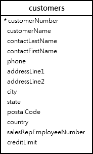

# MySQL OR 연산자

## MySQL OR 연산자 소개

MySQL OR 연산자는 두 개의 부울 표현식을 결합하는 논리 연산자입니다.

```sql
A OR B
```

A와 B가 모두 NULL이 아닌 경우, OR 연산자는 A 또는 B가 0이 아니면 1(참)을 반환합니다. 예를 들어:

```sql
SELECT 1 OR 1, 1 OR 0, 0 OR 1;
```

A와 B가 모두 0(거짓)이면 OR 연산자는 0을 반환합니다. 예를 들어:

```sql
SELECT 0 OR 0;
```

A 및/또는 B가 NULL인 경우, OR 연산자는 A 또는 B가 0이 아니면 1(참)을 반환합니다. 그렇지 않으면 NULL을 반환합니다. 예를 들어:

```sql
SELECT 1 OR NULL, 0 OR NULL, NULL or NULL;
```

다음 표는 참(0이 아님), 거짓(0) 및 NULL을 결합할 때 OR 연산자의 결과를 보여줍니다:

|       | TRUE | FALSE | NULL |
| ----- | ---- | ----- | ---- |
| TRUE  | TRUE | TRUE  | TRUE |
| FALSE | TRUE | FALSE | NULL |
| NULL  | TRUE | NULL  | NULL |

## MySQL OR 연산자와 단락 평가

AND 연산자와 마찬가지로 OR 연산자도 단락 평가됩니다. 다시 말해, MySQL은 결과를 결정할 수 있는 즉시 표현식의 나머지 부분 평가를 중단합니다. 예를 들어:

```sql
SELECT 1 = 1 OR 1 / 0;
```

표현식 1 = 1은 항상 1을 반환하므로 MySQL은 1 / 0 표현식을 평가하지 않습니다. 평가했다면 MySQL은 오류를 발생시켰을 것입니다.

## 연산자 우선순위

표현식에 AND와 OR 연산자가 모두 포함되어 있으면 MySQL은 연산자 우선순위를 사용하여 연산자의 평가 순서를 결정합니다. MySQL은 우선순위가 높은 연산자를 먼저 평가합니다.

AND 연산자가 OR 연산자보다 우선순위가 높으므로 MySQL은 OR 연산자보다 AND 연산자를 먼저 평가합니다. 예를 들어:

```sql
SELECT 1 OR 0 AND 0;
```

작동 방식:

```sql
1 OR 0 AND 0 = 1 OR 0 = 1
```

평가 순서를 변경하려면 괄호를 사용합니다. 예를 들어:

```sql
SELECT (1 OR 0) AND 0;
```

작동 방식:

```sql
(1 OR 0) AND 0 = 1 AND 0 = 0
```

## MySQL OR 연산자 예제

데모를 위해 샘플 데이터베이스의 customers 테이블을 사용하겠습니다.



다음 쿼리는 WHERE 절에서 OR 연산자를 사용하여 미국 또는 프랑스에 위치한 모든 고객을 선택합니다:

```sql
SELECT
	customername,
	country
FROM
	customers
WHERE country = 'USA' OR
      country = 'France';
```

다음 예제는 OR 연산자를 사용하여 미국 또는 프랑스에 위치하고 신용 한도가 100,000보다 큰 고객을 선택합니다.

```sql
SELECT
	customername,
	country,
	creditLimit
FROM
	customers
WHERE(country = 'USA'
		OR country = 'France')
	  AND creditlimit > 100000;
```

괄호를 사용하지 않으면 쿼리는 미국에 위치한 고객 또는 신용 한도가 100,000보다 큰 프랑스에 위치한 고객을 반환합니다.

```sql
SELECT
    customername,
    country,
    creditLimit
FROM
    customers
WHERE
    country = 'USA'
    OR country = 'France'
    AND creditlimit > 100000;
```

요약

- OR 연산자는 두 개의 부울 표현식을 결합하고 표현식 중 하나가 참일 때 true를 반환합니다. 그렇지 않으면 false를 반환합니다.
- 표현식에 AND와 OR 연산자가 모두 포함되어 있으면 MySQL은 AND 연산자 다음에 OR 연산자를 평가합니다.
- 평가 순서를 변경하려면 괄호를 사용합니다.
