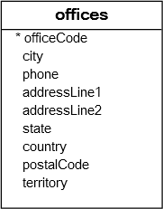

# MySQL IN

## MySQL IN 연산자 소개

IN 연산자를 사용하면 값이 값 목록의 어떤 값과 일치하는지 확인할 수 있습니다. 다음은 IN 연산자의 구문입니다:

```sql
value IN (value1, value2, value3,...)
```

IN 연산자는 값이 목록(value1, value2, value3,...)의 어떤 값과 같으면 1(참)을 반환합니다. 그렇지 않으면 0을 반환합니다.

이 구문에서:

- 첫째, IN 연산자의 왼쪽에 테스트할 값을 지정합니다. 값은 컬럼이거나 표현식일 수 있습니다.
- 둘째, 괄호 안에 일치시킬 값의 쉼표로 구분된 목록을 지정합니다.

IN 연산자는 기능적으로 여러 OR 연산자의 조합과 동일합니다:

```sql
value = value1 OR value = value2 OR value = value3 OR ...
```

다음 예제는 1이 목록에 있으므로 1을 반환합니다:

```sql
SELECT 1 IN (1,2,3);
```

다음 예제는 4가 목록에 없으므로 0을 반환합니다:

```sql
SELECT 4 IN (1,2,3);
```

실제로는 SELECT, DELETE, UPDATE 문의 WHERE 절에서 IN 연산자를 사용하여 조건을 형성합니다. 또한 하위 쿼리를 포함하는 쿼리에서도 IN 연산자를 사용합니다.

## MySQL IN 연산자와 NULL

일반적으로 IN 연산자는 두 가지 경우에 NULL을 반환합니다:

- 연산자의 왼쪽 값이 NULL입니다.
- 값이 목록의 어떤 값과도 같지 않고 목록의 값 중 하나가 NULL입니다.

다음 예제는 IN 연산자의 왼쪽 값이 NULL이므로 NULL을 반환합니다:

```sql
SELECT NULL IN (1,2,3);
```

다음 예제도 NULL을 반환합니다. 0이 목록의 어떤 값과도 같지 않고 목록에 NULL이 하나 있기 때문입니다:

```sql
SELECT 0 IN (1 , 2, 3, NULL);
```

다음 예제도 NULL을 반환합니다. NULL이 목록의 어떤 값과도 같지 않고 목록에 NULL이 하나 있기 때문입니다. NULL은 NULL과 같지 않습니다.

```sql
SELECT NULL IN (1 , 2, 3, NULL);
```

## MySQL IN 연산자 예제

샘플 데이터베이스의 다음 offices 테이블을 참조하세요:



다음 예제는 IN 연산자를 사용하여 미국과 프랑스에 위치한 사무실을 찾습니다:

```sql
SELECT
    officeCode,
    city,
    phone,
    country
FROM
    offices
WHERE
    country IN ('USA' , 'France');
```

다음과 같이 OR 연산자를 사용하여 동일한 결과를 얻을 수도 있습니다:

```sql
SELECT
    officeCode,
    city,
    phone
FROM
    offices
WHERE
    country = 'USA' OR country = 'France';
```

목록에 많은 값이 있는 경우 여러 OR 연산자가 포함된 매우 긴 문을 구성해야 합니다. 따라서 IN 연산자를 사용하면 쿼리를 단축하고 더 읽기 쉽게 만들 수 있습니다.

## 요약

- IN 연산자를 사용하여 값이 값 집합에 있는지 확인합니다.
- WHERE 절의 조건을 형성하기 위해 IN 연산자를 사용합니다.
