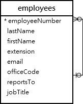

# MySQL LIKE

## MySQL LIKE 연산자 소개

LIKE 연산자는 문자열에 지정된 패턴이 포함되어 있는지 테스트하는 논리 연산자입니다.

다음은 LIKE 연산자의 구문입니다:

```sql
expression LIKE pattern ESCAPE escape_character
```

이 구문에서 표현식이 패턴과 일치하면 LIKE 연산자는 1을 반환합니다. 그렇지 않으면 0을 반환합니다.

MySQL은 패턴을 구성하기 위한 두 가지 와일드카드 문자를 제공합니다: 퍼센트 % 및 밑줄 \_ .

- 퍼센트(%) 와일드카드는 0개 이상의 문자로 구성된 모든 문자열과 일치합니다.
- 밑줄(\_) 와일드카드는 모든 단일 문자와 일치합니다.

예를 들어, s%는 sun 및 six와 같이 문자 s로 시작하는 모든 문자열과 일치합니다. se\_는 see 및 sea와 같이 se로 시작하고 그 뒤에 임의의 문자가 오는 모든 문자열과 일치합니다.

패턴에 와일드카드 문자가 포함되어 있고 이를 일반 문자로 처리하려면 ESCAPE 절을 사용할 수 있습니다.

일반적으로 SELECT, DELETE, UPDATE 문의 WHERE 절에서 LIKE 연산자를 사용합니다.

## MySQL LIKE 연산자 예제

LIKE 연산자를 사용하는 몇 가지 예제를 연습해 보겠습니다. 데모를 위해 샘플 데이터베이스의 다음 employees 테이블을 사용하겠습니다:



### A) 퍼센트(%) 와일드카드로 MySQL LIKE 연산자 사용 예제

이 예제는 LIKE 연산자를 사용하여 이름이 문자 a로 시작하는 직원을 찾습니다:

```sql
SELECT
    employeeNumber,
    lastName,
    firstName
FROM
    employees
WHERE
    firstName LIKE 'a%';
```

이 예제에서 MySQL은 전체 employees 테이블을 스캔하여 이름이 문자 a로 시작하고 그 뒤에 임의의 개수의 문자가 오는 직원을 찾습니다.

이 예제는 LIKE 연산자를 사용하여 성이 리터럴 문자열 on으로 끝나는 직원을 찾습니다. 예: Patterson, Thompson:

```sql
SELECT
    employeeNumber,
    lastName,
    firstName
FROM
    employees
WHERE
    lastName LIKE '%on';
```

문자열에 부분 문자열이 포함되어 있는지 확인하려면 부분 문자열의 시작과 끝에 퍼센트(%) 와일드카드를 사용할 수 있습니다.

예를 들어, 다음 쿼리는 LIKE 연산자를 사용하여 성에 부분 문자열 on이 포함된 모든 직원을 찾습니다:

```sql
SELECT
    employeeNumber,
    lastName,
    firstName
FROM
    employees
WHERE
    lastname LIKE '%on%';
```

### B) 밑줄(\_) 와일드카드로 MySQL LIKE 연산자 사용 예제

이름이 문자 T로 시작하고 문자 m으로 끝나며 그 사이에 임의의 단일 문자가 포함된 직원을 찾으려면(예: Tom, Tim), 다음과 같이 밑줄(\_) 와일드카드를 사용하여 패턴을 구성합니다:

```sql
SELECT
    employeeNumber,
    lastName,
    firstName
FROM
    employees
WHERE
    firstname LIKE 'T_m';
```

### C) MySQL NOT LIKE 연산자 예제

MySQL을 사용하면 NOT 연산자를 LIKE 연산자와 결합하여 특정 패턴과 일치하지 않는 문자열을 찾을 수 있습니다.

성이 문자 B로 시작하지 않는 직원을 검색하려면 다음과 같이 NOT LIKE 연산자를 사용할 수 있습니다:

```sql
SELECT
    employeeNumber,
    lastName,
    firstName
FROM
    employees
WHERE
    lastName NOT LIKE 'B%';
```

---

**_참고:_** 패턴은 대소문자를 구분하지 않습니다. 따라서 b% 및 B% 패턴은 동일한 결과를 반환합니다.

---

```sql
Sample Code
```

### ESCAPE 절과 함께 MySQL LIKE 연산자 사용

때때로 패턴에 와일드카드 문자가 포함될 수 있습니다. 예: 10%, \_20 등.

이 경우 ESCAPE 절을 사용하여 이스케이프 문자를 지정하면 LIKE 연산자가 와일드카드 문자를 리터럴 문자로 해석합니다.

이스케이프 문자를 명시적으로 지정하지 않으면 백슬래시 문자(\\)가 기본 이스케이프 문자입니다.

예를 들어, 제품 코드에 문자열 \_20이 포함된 제품을 찾으려면 기본 이스케이프 문자와 함께 패턴 %\_20%를 사용할 수 있습니다:

```sql
SELECT
    productCode,
    productName
FROM
    products
WHERE
    productCode LIKE '%\_20%';
```

또는 ESCAPE 절을 사용하여 다른 이스케이프 문자(예: $)를 지정할 수 있습니다:

```sql
SELECT
    productCode,
    productName
FROM
    products
WHERE
    productCode LIKE '%$_20%' ESCAPE '$';
```

패턴 %$\_20%는 \_20 문자열을 포함하는 모든 문자열과 일치합니다.

## 요약

- LIKE 연산자를 사용하여 값이 패턴과 일치하는지 테스트합니다.
- % 와일드카드는 0개 이상의 문자와 일치합니다.
- \_ 와일드카드는 단일 문자와 일치합니다.
- ESCAPE 절은 기본 이스케이프 문자(\\) 이외의 이스케이프 문자를 지정합니다.
- NOT 연산자를 사용하여 LIKE 연산자를 부정합니다.
